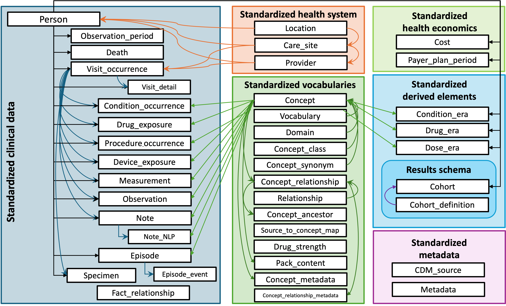
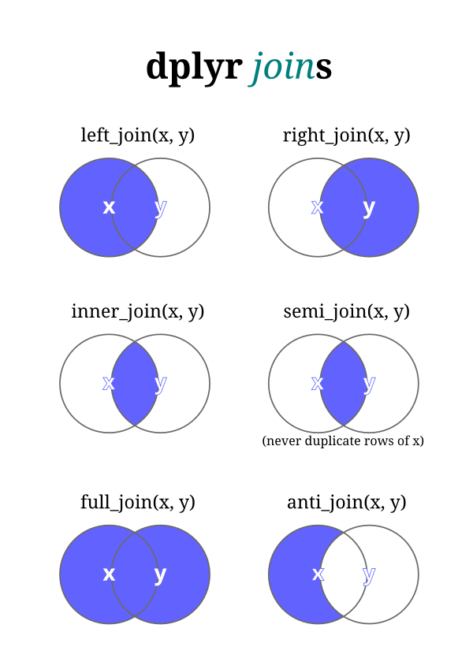

## Today's Goals

By the end you will be able to:

::: {.incremental}
- Recognize common **tables/structures** that make up EHR and wearable data (patients, encounters, labs)
- Understand **keys (키)** and how tables relate: 1:1, 1:many, many:many
- Explain why healthcare data is typically **normalized** (split across many tables) rather than one flat spreadsheet
- Inspect data **types and structure**
- Use R to **summarize** data and **join** tables together
:::

---

## Why This Matters

::: {.incremental}
- EHR data almost never arrives as a single, tidy data.frame
- A single patient is found across many tables: demographics, encounters, diagnoses, labs, medications, vitals...
- Before you can clean, cohort, or model anything, you need to know **how these tables connect**
- Getting a join wrong duplicates or drops patients — a common error we easily miss
:::

---

## R Column Types {.scrollable}

| Abbreviation | Type | Example | Common EHR use |
|---|---|---|---|
| `chr` | character (string) | `"PT-001"` | IDs, names, free text |
| `int` | integer | `3L` | counts (# of visits, age in years) |
| `dbl` | double (decimal number) | `7.8`, `98.6` | lab values, vitals, BMI |
| `lgl` | logical | `TRUE` / `FALSE` | flags (e.g., `readmitted`, `deceased`) |
| `fct` | factor (unordered categories) | `"M"`, `"F"` | sex, race, encounter type |
| `ord` | ordered factor | `Mild < Moderate < Severe` | disease stage, pain scale |
| `date` | calendar date | `2022-01-05` | birth date, encounter date |
| `dttm` | date-time (POSIXct) | `2022-01-05 14:32:00` | wearable timestamps, lab draw time |
| `list` | list-column (nested data) | a vector of codes per row | multiple ICD codes per encounter |
| `raw` | raw bytes | `01 4a 3f` | rarely seen directly; binary/hash data |

---

## Example Column Types with EHR Data

```{r}
#| label: demo-types
#| echo: false

library(tidyverse)

demo <- tibble(
  patient_id   = c("PT-001", "PT-002", "PT-003"),                      # chr
  age          = c(58L, 45L, 72L),                                     # int
  bmi          = c(24.3, 31.8, 27.1),                                  # dbl
  deceased     = c(FALSE, FALSE, TRUE),                                # lgl
  sex          = factor(c("F", "M", "F")),                             # fct
  disease_stage = factor(c("Mild", "Severe", "Moderate"),
                          levels = c("Mild", "Moderate", "Severe"),
                          ordered = TRUE),                             # ord
  enroll_date  = as.Date(c("2020-01-01", "2019-06-15", "2021-03-10")), # date
  last_reading = as.POSIXct(c("2022-01-05 14:32:00",
                               "2022-01-06 09:15:00",
                               "2022-01-07 22:47:00")),                # dttm
  icd_codes    = list(c("E11.9"), c("I10", "E78.5"), c("J45.909"))     # list
)

glimpse(demo)
```

---

## Why This Matters

::: {.incremental}
- `int` vs `dbl` — both are "numeric," but `int` always whole number; most lab values should be `dbl`
- `fct` vs `chr` — factors store fixed categories with defined levels; useful for tables/models, but can drop values if not re-leveled
- `ord` — preserves a meaningful **order** (Mild < Moderate < Severe), which can matter for ordinal regression models
- `date`/`dttm` — enable date arithmetic and correct time-based joins; storing dates as `chr` breaks this
- `list` — appears when a single row has *multiple* values
:::

::: {.callout-important}
Watch out (주의사항): dates or numbers imported as `chr` because of a stray text value in the column (e.g., `"unknown"` in a lab column).
:::

# Part 1: Medical Data Structures

---

## The Three Building Blocks

Most EHR systems (and OMOP CDM) organize data around three conceptual levels:

| Level | Unit (one row = ...) | Examples |
|---|---|---|
| **Patient-level** | one patient | demographics, birth date, sex, enrollment start/end |
| **Encounter-level** | one visit/admission | encounter date, type (outpatient/inpatient/ED), provider, location |
| **Event-level** (labs, meds, vitals) | one measurement or event, tied to an encounter | lab result, drug order, vital sign reading |

::: {.callout-note}
This mirrors the OMOP CDM structure: `PERSON` → `VISIT_OCCURRENCE` → `MEASUREMENT` / `CONDITION_OCCURRENCE` / `DRUG_EXPOSURE`, etc.
:::

---

## OHDSI OMOP Common Data Model (CDM)

{fig-align="center"}

---

## Patient-Level Data

- One row **per patient** — the most "static" table
- Some data rarely or never change, like birth date
- This is the table everything else eventually links back to

```{r}
#| label: patients-table
#| echo: false

patients <- tibble(
  patient_id = c("PT-001", "PT-002", "PT-003"),
  birth_date = as.Date(c("1965-03-14", "1978-11-02", "1990-07-22")),
  sex        = c("F", "M", "F"),
  enroll_start = as.Date(c("2018-01-01", "2019-06-15", "2020-02-10"))
)

patients
```

- What other data might the EHR have like this? 

---

## Encounter-Level Data

- One row **per visit/admission** — a patient can have *many* encounters
- Contains: encounter date, encounter type, provider, discharge disposition

```{r}
#| label: encounters-table
#| echo: false

encounters <- tibble(
  encounter_id = c("E-1001", "E-1002", "E-1003", "E-1004", "E-1005"),
  patient_id   = c("PT-001", "PT-001", "PT-002", "PT-003", "PT-003"),
  encounter_date = as.Date(c("2022-01-05", "2022-06-20", "2022-03-11",
                              "2022-02-01", "2022-09-30")),
  encounter_type = c("Outpatient", "Inpatient", "Outpatient",
                      "Emergency", "Outpatient")
)

encounters
```

Notice: **PT-001** and **PT-003** each have 2 encounters; **PT-002** has 1. This is already a **1:many** relationship.

---

## Event-Level Data

- One row **per measurement/event**, tied to a specific encounter
- Highest volume, most granular table — a single encounter can generate many rows

```{r}
#| label: labs-table
#| echo: false

labs <- tibble(
  lab_id = paste0("L-", 2001:2007),
  encounter_id = c("E-1001", "E-1001", "E-1002", "E-1002",
                    "E-1003", "E-1004", "E-1005"),
  loinc_code = c("2160-0", "718-7", "2160-0", "4548-4",
                 "2160-0", "718-7", "4548-4"),
  lab_name = c("Creatinine", "Hemoglobin", "Creatinine", "HbA1c",
               "Creatinine", "Hemoglobin", "HbA1c"),
  value = c(1.1, 13.2, 1.4, 7.8, 0.9, 11.5, 6.9)
)

labs
```

Each **encounter** can have **many** lab rows — another 1:many relationship, one level down.

---

## Relationships

```{mermaid}
%%| echo: false

erDiagram
    STUDENT ||--|| LOCKER : has
    TEACHER ||--o{ COURSE : teaches
    STUDENT }o--o{ COURSE : "enrolled in"

    STUDENT {
        int student_id PK
        string name
    }
    LOCKER {
        int locker_id PK
        int student_id FK
        string location
    }
    TEACHER {
        int teacher_id PK
        string name
    }
    COURSE {
        int class_id PK
        int teacher_id FK
        string subject
    }
```

Question: what does a many:many data table look like?

# Part 2: Keys (키) and Relationships

---

## What Is a Key (키)?

- A **key ()** is the column (or set of columns) that *uniquely* identifies rows in a table, and lets tables link to each other
- **Primary key** — uniquely identifies each row in *its own* table (e.g., `patient_id` in `patients`, `encounter_id` in `encounters`)
- **Foreign key** — a column in one table that refers to the primary key of another table (e.g., `patient_id` in `encounters` refers back to `patients`)

```{r}
#| label: key-check

# patient_id is a primary key in `patients` -- must be unique
count(patients, patient_id)

# patient_id is a FOREIGN key in `encounters` -- duplicates are expected!
count(encounters, patient_id)
```

---

## 1:1 Relationships

- Each row in Table A matches **exactly one** row in Table B
- Less common in raw EHR data, more common after you've already summarized a table

```{r}
#| label: one-to-one-example

patient_demo <- tibble(
  patient_id = c("PT-001", "PT-002", "PT-003"),
  race = c("Asian", "White", "Black"),
  language = c("Korean", "English", "English")
)

patients
patient_demo
```

---

## 1:Many Relationships

- Each row in Table A (the "one" side) can match **multiple** rows in Table B (the "many" side)
- This is the **most common** relationship in EHR data:
  - one patient → many encounters
  - one encounter → many labs

```{r}
#| label: one-to-many-example

# one patient (PT-001) -> two encounters
encounters |>
  filter(patient_id == "PT-001")
```

::: {.callout-note}
**Warning:** if you join a "one" table to a "many" table, your row count will **grow** to match the "many" side — depending on type of join.
:::

---

## Many:Many Relationships

- Occurs when neither side is unique — e.g., many doctors seeing patients at many clinics
- You need a **linking/bridge table** (provider_id + clinic_id pairs)

```{r}
doctor_clinic <- data.frame(
  doctor_id = c(1, 1, 2, 3, 3, 3, 4),
  clinic_id = c(1, 2, 1, 1, 2, 3, 3)
)

doctor_clinic
```


# Part 3: Why Normalize?

---

## Normalized vs. Flat Data

**Flat (de-normalized):** one big table repeating patient info on every lab row

```{r}
#| label: flat-example
#| echo: false

flat <- labs |>
  left_join(encounters, by = "encounter_id") |>
  left_join(patients, by = "patient_id")

flat |>
  select(patient_id, birth_date, sex, encounter_date, lab_name, value)
```

::: {.callout-important}
Notice `sex` and `birth_date` repeat across every single lab row for the same patient — why might this not be good?
:::

---

## Why Normalized Structures Instead

::: {.incremental}
- **Avoids redundancy** — a patient's birth date is stored once, not thousands of times
- **Avoids update anomalies** — fix a patient's demographic info in one place, not every row where it's duplicated
- **Smaller storage footprint** — important for EHR scale (millions of patients, billions of lab rows)
- **Matches how data is actually generated** — encounters and labs are created at different times, by different systems
- **This is exactly why OMOP CDM use multiple linked tables**
:::

::: {.callout-important}
You **must join tables back together** to answer most research questions.
:::

# Part 4: Joining Data in R

---

## Joins (tidyverse)

| Function | Keeps... |
|---|---|
| `left_join(a, b)` | all rows of `a`, matching rows of `b` (`NA` if no match) |
| `inner_join(a, b)` | only rows that match in **both** tables, adds rows |
| `right_join(a, b)` | all rows of `b`, matching rows of `a` |
| `full_join(a, b)` | all rows from **both** tables |
| `semi_join(a, b)` | rows of `a` that **have a match** in `b` (no columns added) |
| `anti_join(a, b)` | rows of `a` that **do NOT have a match** in `b` |

Use the `relationship` argument to specify if 1:1, 1:many, many:many...

---

## Joins

{fig-align="center"}

---

## Fancy Joins

There are other ways (and packages) to do joins besides these in R:

- `fuzzyjoin`: fuzzy criteria, not exact
- `powerjoin`: more flexible, safe, handle conflicts
- `data.table`: rolling joins and fast

---

## Join Example: Patients + Encounters (1:Many)

```{r}
#| label: join-1-many
#| error: true

patients |>
  left_join(encounters, by = "patient_id", relationship = "one-to-one")

patients |>
  left_join(encounters, by = "patient_id", relationship = "one-to-many")
```

Row count **grows** from 3 patients to 5 rows — expected, since this is a 1:many join.

---

## Join Example: Encounters + Labs (1:Many, one level down)

```{r}
#| label: join-encounters-labs

encounters |>
  inner_join(labs, by = "encounter_id", relationship = "one-to-many") |>
  select(patient_id, encounter_date, lab_name, value)
```

::: {.callout-note}
Used `inner_join` here — only encounters that **have** lab results are kept. Compare this to `left_join`, which would also keep encounters with no labs (value = `NA`).
:::

---

## Putting It Together: A Mini Patient-Level Summary

```{r}
#| label: full-pipeline-example

encounters |>
  reframe(n_encounters = n(), .by = "patient_id") |>
  left_join(patients, by = "patient_id") |>
  left_join(
    labs |>
      inner_join(encounters, by = "encounter_id") |>
      reframe(n_labs = n(), .by = "patient_id"),
    by = "patient_id"
  )
```

This pipeline moves from **event-level → encounter-level → patient-level**

---

## Difficult Example: Matching Labs to Drug Exposure

We want to find all **lab results drawn within 7 days** (before or after)
of a **drug exposure start date** for each patient.

*"What labs were around the time this medication was started?"*

```{r}
#| echo: false
library(fuzzyjoin)

labs <- data.frame(
  person_id = c(1, 1, 1, 2, 2),
  lab_date  = as.Date(c("2024-01-01", "2024-01-10",
                         "2024-01-15", "2024-02-01", "2024-02-15")),
  glucose   = c(95, 110, 130, 88, 140)
)

drugs <- data.frame(
  person_id  = c(1, 2),
  drug_date  = as.Date(c("2024-01-12", "2024-02-05")),
  drug_name  = c("Metformin", "Insulin")
)

labs
drugs
```

---

## fuzzyjoin: Interval Join

For each drug, keep labs where `drug_date - 7 <= lab_date <= drug_date + 7`,
matched **within the same person**.

```{r}
drugs <- drugs |>
  mutate(window_start = drug_date - 7, 
         window_end   = drug_date + 7)

labs |>
  fuzzy_inner_join(
    drugs,
    by = c("person_id"   = "person_id",
           "lab_date"    = "window_start",
           "lab_date"    = "window_end"),
    match_fun = list(`==`, `>=`, `<=`)
  ) |>
  select(person_id = person_id.x, drug_name, drug_date, lab_date, glucose)
```

---

## Recap

::: {.incremental}
- EHR data is organized in layers: **patient → encounter → event**
- **Keys** (primary/foreign) define how tables connect; most relationships are **1:many**
- Data is **normalized** (split into linked tables) to avoid duplication — you must **join** tables to analyze them
:::

::: {.callout-note}
In R: check **structure and types** (`str`, `glimpse`) after get data, **summarize** before joining, and **check row counts** after every join
:::

---

## Summarizing Data

```{r}
#| label: summarize-data

head(iris)
summary(iris)
```

---

## Summarizing Data with `skimr` {.scrollable}

```{r}
#| label: summarize-data-skimr

library(skimr)

glimpse(starwars)
skim(starwars)
```

---

## Questions?

질문 있으세요?


